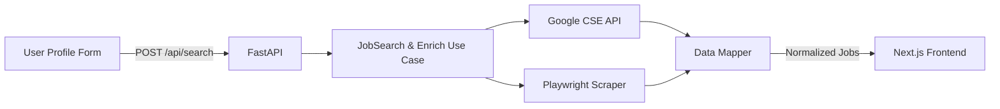

# 🌐 Job Market Scraper

**Job Market Scraper** is a full-stack application that automates the discovery of international job opportunities and ranks them based on user-defined criteria such as  **tech stack** ,  **location** , and  **seniority** .

The system consists of two independent yet fully integrated parts:

* 🧠 **Backend (Python/FastAPI)** — builds intelligent Google search queries, scrapes job listings, and enriches them with structured metadata.
* 💼 **Frontend (Next.js/React)** — provides an intuitive, multilingual web interface for entering professional profiles and visualizing ranked job results.

---

## 🚀 Core Concept

> "Find the most relevant remote or global job listings — automatically."

The backend dynamically composes targeted search queries (e.g., `"Python" + "Junior" + "remote"`) and retrieves postings via Google’s Custom Search API and Playwright scraping.

The frontend consumes this API to present ranked results with compatibility percentages, highlighting matching and missing skills.

---

## 🧩 Architecture Overview



* **Frontend:** Type-safe React app (Next.js 16 + TypeScript + Tailwind).
* **Backend:** Async FastAPI service with modular architecture and typed domain models.
* **Communication:** JSON REST endpoint (`/api/search`) returning ranked job lists.
* **Deployment:** Can run locally or in Docker, with CI/CD integration ready.

---

## 🏗️ Repository Structure
```bash
├── frontend/
│   └── README.md
├── backend/
│   └── README.md
├── .env.example
├── docker-compose.yml
├── LICENSE
└── README.md
```

---

## ⚙️ Tech Stack

| Layer                  | Technology                                              | Highlights                                                    |
| ---------------------- | ------------------------------------------------------- | ------------------------------------------------------------- |
| **Frontend**     | Next.js 16, React 18, TypeScript, TailwindCSS           | App Router, i18n (pt/en), typed hooks, accessible design      |
| **Backend**      | Python 3.11, FastAPI, asyncio, Playwright               | Async scraping, Google CSE API integration, modular use-cases |
| **Infra/DevOps** | Docker, uv (Python task runner), GitHub Actions (CI/CD) | Lightweight deployment and reproducible environments          |
| **Testing**      | pytest, FastAPI TestClient                              | Fully isolated unit tests with dependency mocks               |
