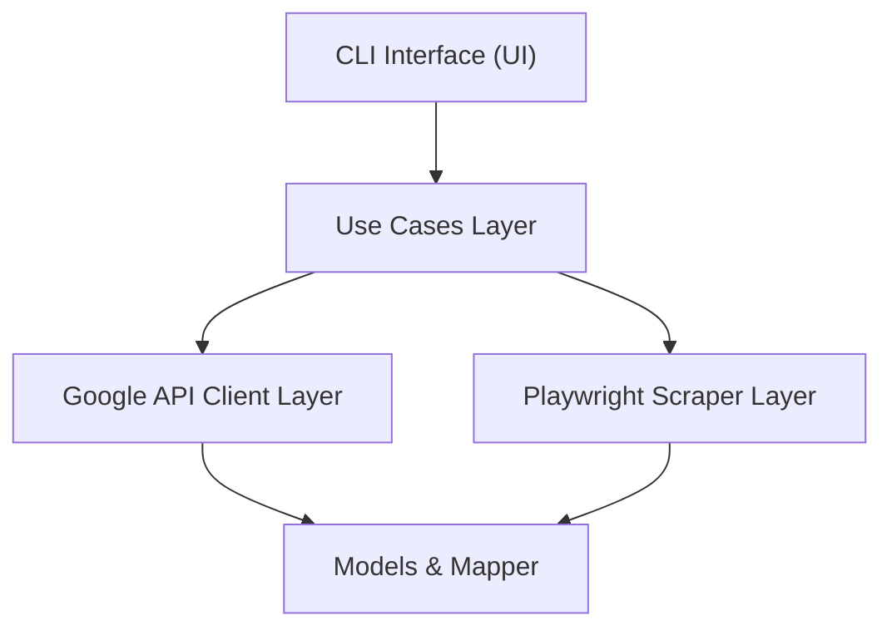

# 🧠 Job Market Scraper - Backend

**Job Market Scraper** is a focused, production-oriented MVP that automates the discovery of international job postings by composing targeted Google search queries and retrieving results via the **Google Custom Search (CSE) API**.

It allows flexible parameterization (location, role, seniority, and limit) and, in the future, will produce standardized outputs for analysis or integration with downstream systems such as analytics pipelines, databases, or recruitment platforms.

The application is written in Python 3.11, uses modular services, and can be run locally, in Docker, or as part of an automated CI/CD pipeline.

---

# 🛠️ Technical Features

## 🏗️ Architecture and Modules

* **Core Layer (`src/core`)** : Implements domain logic including:
  * **Query Builder:** Constructs combinatorial, parametric queries based on role, location, and seniority using Python's itertools and builder pattern.
  * **Filters and Validators:** Modular job filtering (e.g., time-based filtering) and validation logic to normalize and curate scraped data.
  * **Use Cases:** Orchestrates the job search and enrichment process, harnessing API calls and scraping results.
* **CLI Interface (`src/interface/cli`)** :
  * **Argument Parsing (`args.py`):** Built on argparse with typed namespace, validating multi-valued CLI inputs for granular control over search parameters.
  * **UI Module (`ui.py`, `styler.py`, `colorama_formatter.py`):** Returns ANSI-styled formatted strings improving testability and enabling downstream consumption for CLI or frontend display.
  * **Main CLI Runner (`cli.py`):** Async entrypoint managing full lifecycle including argument parsing, query construction, network I/O with Playwright and Google Services, logging, and graceful error handling.
* **Models (`src/models`)** :
* Uses Pydantic-like or dataclass models (`job_model.py`) for strong typing and easy interchange of job posting details through the pipeline.
* **Services Layer (`src/services`)** :
  * **Google Jobs API Adapter (`service.py` and `client.py`):** Async HTTP client with request formation, paging, retry mechanism, and response mapping to internal models.
  * **Playwright-based Scraper (`playwright_scraper.py`):** Handles JavaScript-heavy pages using headless browser automation, with concurrency, navigation, and error resilience.
  * **Mapper (`mapper.py`):** Normalizes external data schemas into standardized job posting objects, isolating variability of data sources.

---

## 💡 Key Technical Considerations

* **Asynchronous Design Pattern** :
  The entire data acquisition flow employs `asyncio` facilities to maximize throughput in network-bound operations, including multi-source API calls and asynchronous scraping sessions, enabling parallelism with minimal blocking.
* **Modular Decoupling** :
  Each component—query construction, scraping, API communication, data transformation, validation, UI formatting—is encapsulated to minimize interdependencies, easing testing, maintenance, and future feature extensions.
* **Robust Error Handling and Logging** :
  Systematic try/except blocks with contextual logging ensure resilience against transient failures, enabling retriable operations while providing detailed traceability for debugging and monitoring.
* **Reusability and Testability** :
  UI functions  **return formatted strings instead of printing directly** , supporting unit testing without capturing stdio, and allowing easy adaptation to different output formats (CLI, web apps).
* **CLI Usability** :
  Supports multiple filters in command-line arguments with extensible query combinatorics that generate comprehensive coverage of search space without manual query repetition.

---

## 📊 High-Level Workflow



---

## 🧩 Installation (recommended)

1. **Requirements & supported environment**

- **Python 3.11 or higher** (type hints and dataclasses targeted to 3.11)
- **Google Custom Search Engine setup:** Requires a valid CSE ID and API key to execute searches on Google Jobs.
- **Runtime dependencies:** Defined in pyproject.toml; recommended to install using uv task runner or pip.
- **Docker:** Optionally, you can build and run the project inside a Docker container.

2. **Clone the repository:**

```bash
git clone git@github.com:MatheusFernandesDuarte/Job-Market-Scraper.git
cd job-market-scraper
```

3. **Initialize the project with ``uv``:**

```bash
uv init
```

4. **Create and activate a virtual environment:**

```bash
uv venv
```

4. **Install dependencies:**

```python
uv sync
```

5. **Create .env file (see .env.example):**

```python
GOOGLE_API_KEY=your_api_key_here
GOOGLE_CX=your_custom_search_engine_id_here
```

## ▶️ Usage

#### Two supported ways to run the CLI:

1. **Using uv (author's workflow)**

If you manage run tasks with uv (project includes uv.lock), you can run the CLI via:

```bash
uv run run.py -- --location "remote" --seniority "Junior" --role "Data Science" --max 20
```

- Note: uv run run.py -- passes flags through to the script. Adjust depending on your uv configuration.

2. **Docker Container**

```bash
docker build -t job-market-scraper .
docker run --rm -it job-market-scraper
```

## 🔍 Example query composition

The query builder formats terms as quoted tokens and joins them with +:

```arduino
"remote" + "Junior" + "Data Science" --max 20
```

This mirrors the strategy you described in the project brief: combine location/flexibility terms + seniority + role to surface international opportunities.

## 🚩 CLI flags (representative)

The project exposes a CLI (src/interface/cli/cli.py). Common flags (example) include:

- --location — e.g., "remote", "latam", "brazil", "work from anywhere"
- --seniority — e.g., "Junior", "Mid", "Senior"
- --role — e.g., "Data Science", "Software Engineer"
- --max - maximum number of returned postings (int)

Refer to the CLI source for the exact, authoritative argument names and options.

### 🧑‍💻 Author & contact

Matheus — Software Engineer

[](https://www.linkedin.com/in/matthfeeer)
